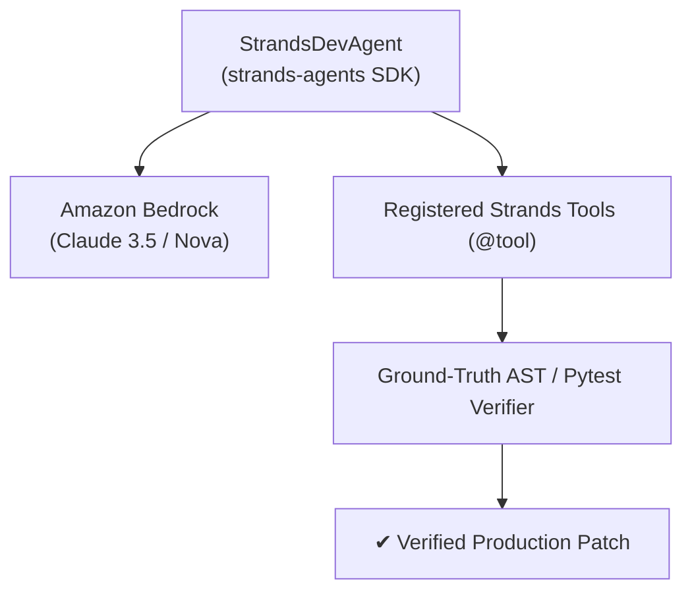

# 📝 builder.aws Blog Post Draft (+0.6 Bonus Points)
### Title: **Agents for Humans: Building an Autonomous Self-Healing DevOps Agent with AWS Strands SDK & Amazon Bedrock**
> **Destination**: Publish publicly on [builder.aws.com](https://builder.aws.com/) using your AWS Builder ID login.  
> **Rule Compliance**: Must include **"Agents for Humans"** in the title.

---

## Blog Post Content

### Introduction
When we think about AI agents in software engineering, the biggest frustration developers face isn't generating code snippets — it's the tedious, manual triage of broken CI/CD pipelines, messy runtime tracebacks, and merge conflicts. 

For the **AWS Agents for Humans Hackathon (Professional Agents Track)**, I wanted to build an agent that does real work end-to-end: **K-CLI for Devs**, an autonomous, self-healing developer workstation powered by the **AWS Strands Agents SDK** and **Amazon Bedrock**.

---

### The Architecture: Why Strands Agents SDK?
Traditional LLM wrappers either get stuck in infinite loops or hallucinate unverified code. The **Strands Agents SDK** provided the perfect foundation with its model-driven approach, clean `@tool` abstraction, and execution safety limits.

In **K-CLI for Devs**, we designed an architecture where:
1. **The Brain (Strands Agent + Amazon Bedrock)**: Uses Anthropic Claude 3.5 Sonnet / Amazon Nova Pro on Bedrock for high-reasoning planning and root-cause analysis.
2. **The Hands (Deterministic Tool Suite)**: We exposed 7 heavy-duty developer tools as Strands `@tool`s:
   - `triage_and_heal_incident`: Multi-language crash parser (Python, Node, Rust, Go, C++, Docker, GitHub Actions).
   - `verify_code_file`: Closed-loop ground-truth AST & compiler verifier.
   - `apply_surgical_patch`: Line-accurate fuzzy search/replace block patcher.
   - `resolve_git_merge_conflict`: 3-way AST merge conflict resolver.
   - `inspect_repo_structure`: Topological symbol & dependency mapper.
   - `search_offline_docs`: Embedded SQLite FTS5 DevDocs engine.
   - `generate_architecture_diagram`: Mermaid architecture synthesizer.

---

### Key Lessons & Implementation Highlights

#### 1. Closed-Loop Ground-Truth Verification
The core philosophy of K-CLI is: **Never trust unverified code.** When the Strands Agent drafts a patch, it immediately calls `verify_code_file`. If a syntax error or failing assertion is detected, the exact compiler stderr is fed back into the agent loop to self-heal autonomously (up to 3 retries).

#### 2. Surgical Patching over Whole-File Rewrites
Asking models to rewrite 1,000-line files often causes accidental deletions. By utilizing surgical `SEARCH/REPLACE` blocks, the agent isolates changes to exact AST symbol boundaries with guaranteed rollback safety.

---

### Conclusion & Open Source
Building on AWS Strands Agents SDK demonstrated how AI agents can shift from being conversational novelties to reliable, autonomous members of engineering teams.

* **GitHub Repository**: [https://github.com/krishivjoshi219-collab/K-Cli-for-Devs](https://github.com/krishivjoshi219-collab/K-Cli-for-Devs)
* **License**: MIT Open Source

Try it out, and let me know your thoughts on autonomous incident healing!
