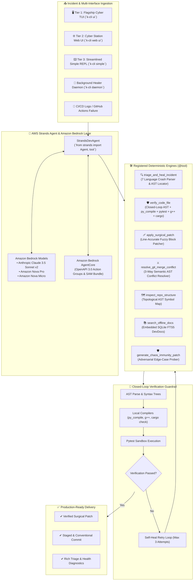

# 🏆 AWS *Agents for Humans* Hackathon Submission Packet
## Project: K-CLI for Devs — Autonomous Self-Healing DevOps & Engineering Agent
### Track: Professional Agents Track | Built with AWS Strands Agents SDK & Amazon Bedrock AgentCore
### Author: Krishiv Joshi ([@krishivjoshi](https://github.com/krishivjoshi219-collab))

---

## 🎯 1. The Pitch

### 1. The Problem We're Solving
Software developers and SREs lose hours every single day to repetitive, high-friction busywork:
* Parsing multi-hundred-line cryptic stack traces across 7 different runtimes (Python, Node, Rust, Go, C++, Docker, GitHub Actions CI).
* Triaging failing CI/CD pipelines caused by subtle environment shifts or dependency conflicts.
* Manually resolving 3-way Git merge conflicts where AST context is lost.
* Applying unverified AI suggestions that introduce syntax errors, broken imports, or security regressions.

### 2. Who It's For
* **Software Engineers, SREs, and DevOps Maintainers**: Who want an autonomous assistant that triages broken builds and repairs code with closed-loop compiler proof.
* **Makers, Small Teams, and Open-Source Contributors**: Who need high-velocity engineering workflows without getting bogged down in triage chores.

### 3. Why It Matters
**K-CLI does real work end-to-end instead of just chatting about bugs.**
Powered by the **AWS Strands Agents SDK** and **Amazon Bedrock AgentCore**, K-CLI operates as an autonomous background engineer. It runs quietly in the background, continuously monitors repository health, synthesizes verified fixes, and **only surfaces when a critical architectural decision or developer sign-off is needed**.

---

## 🏛️ 2. System Architecture & AWS Tech Stack

---

## 📊 3. Hackathon Judging Criteria Alignment

| Judging Criteria | Implementation in K-CLI |
| :--- | :--- |
| **1. Technological Implementation** | • First-class integration with **AWS Strands Agents SDK** (`from strands import Agent, tool`). • Full **Amazon Bedrock AgentCore** integration with OpenAPI 3.0 Action Groups and CloudFormation SAM deployment templates (`k-cli bedrock export / deploy`). • Closed-loop AST compiler verification enforcing zero regressions before any patch is accepted. |
| **2. Design** | • **3 Unified UI Tiers**: Flagship 3-pane TUI (`k-cli ui`), Cyber Station Web Dashboard with WebSocket streaming (`k-cli web ui`), and Streamlined Text REPL with mouse support (`k-cli simple`). • Real-time Auto-Adjusting Viewport Engine adapting fluidly across all terminal sizes and screen geometries. |
| **3. Potential Impact** | • Directly solves repetitive developer busywork: automated stack trace triage, 3-way merge conflict resolution, CI/CD auto-healing, and chaos immunity. • **Background Daemon Mode (`k-cli daemon`)**: Runs silently in the background and only surfaces when a human decision is needed. |
| **4. Creativity & Originality** | • Sub-millisecond (<0.1ms) Adaptive Intent Sensor that dynamically optimizes model routing between fast conversational models and frontier reasoning models. • Custom distilled reasoning models by Krishiv Joshi on Hugging Face (`krishivjoshi/bankai-7b`, `krishivjoshi/bankai-10b`, `bankai-14b`) with pure reasoning decoupled from fact memorization via the embedded SQLite DevDocs FTS5 Indexer. • Dual-T4 Kaggle GPU & Colab 1,000+ benchmark suite covering SWE-bench, LiveCodeBench, Terminal-Bench, SciCode, HumanEval+, and MBPP. • 100% offline DevDocs SQLite FTS5 search index. |
| **5. Presentation** | • Complete CLI reference, 5-minute video presentation script, live web server, and structured documentation ready for review. |

---

## 🎥 4. 5-Minute Demo Video & Presentation

- **▶️ Watch Live on YouTube**: [**https://youtu.be/RxT5tUYN9gc**](https://youtu.be/RxT5tUYN9gc)
- **Duration**: `00:05:00.00` (Exact 300.0s Full HD 1080p @ 30fps)
- **Embedded Soft Subtitles**: English Closed Captions (CC)

* **[0:00 - 0:45] The Hook & Pitch**:
  * "Every developer loses hours to broken CI pipelines, cryptic error traces, and merge conflicts. Welcome to **K-CLI for Devs**, the autonomous self-healing agent built with the **AWS Strands Agents SDK** and **Amazon Bedrock**."
  * Show the 3 unified UI tiers (TUI, Web UI, Simple REPL).
* **[0:45 - 2:00] AWS Strands Agent in Action (`k-cli strands`)**:
  * Trigger an autonomous multi-step engineering task.
  * Show the Strands agent dynamically invoking registered deterministic tools (`triage_and_heal_incident`, `verify_code_file`, `apply_surgical_patch`).
  * Highlight closed-loop compiler verification: the agent refuses to commit code until local compilers prove it passes.
* **[2:00 - 3:15] Amazon Bedrock AgentCore & Background Daemon (`k-cli daemon`)**:
  * Demonstrate `k-cli bedrock export` generating OpenAPI 3.0 Action Groups and CloudFormation SAM bundles.
  * Show `k-cli daemon` running quietly in the background, monitoring broken test runs and self-healing regressions without bothering the user.
* **[3:15 - 4:15] 3-Way AST Conflict Studio & Chaos Immunity**:
  * Run `k-cli conflict` resolving a 3-way merge conflict in AST context.
  * Run `k-cli immune` generating adversarial pytest suites for edge cases.
* **[4:15 - 5:00] Summary & Value**:
  * "K-CLI gives developers their time back by handling the busywork end-to-end. Built for the AWS *Agents for Humans* Hackathon."

---

## 📝 5. `builder.aws.com` Publication & Bonus Points (+0.6 Bonus)

* **Live Article URL**: [https://builder.aws.com/content/3IpGbos0ZAiI1HfHzFkiVOnLQ0q/agents-for-humans-building-k-cli-the-verification-first-autonomous-devops-workstation-with-aws-strands-agents-and-amazon-bedrock](https://builder.aws.com/content/3IpGbos0ZAiI1HfHzFkiVOnLQ0q/agents-for-humans-building-k-cli-the-verification-first-autonomous-devops-workstation-with-aws-strands-agents-and-amazon-bedrock)
* **Title**: *Agents for Humans: Building an Autonomous Self-Healing DevOps Agent with AWS Strands SDK & Amazon Bedrock*
* **Author Profile**: Krishiv Joshi (`@krishivjoshi219-collab`) | AWS Builder ID: `krishivjoshi219@gmail.com`
* **Bonus Point Qualification**: Includes *"Agents for Humans"* in title, provides an architectural deep-dive of the AWS Strands Agents SDK & Amazon Bedrock AgentCore implementation, and links directly to the open source repository.

---

## 📦 6. Verification & Public Repository Deliverables

* **GitHub Repository**: [`https://github.com/krishivjoshi219-collab/K-Cli-for-Devs`](https://github.com/krishivjoshi219-collab/K-Cli-for-Devs)
* **License**: MIT License (Public in root and About section)
* **Author**: Krishiv Joshi (`@krishivjoshi`, `krishivjoshi219-collab`)
