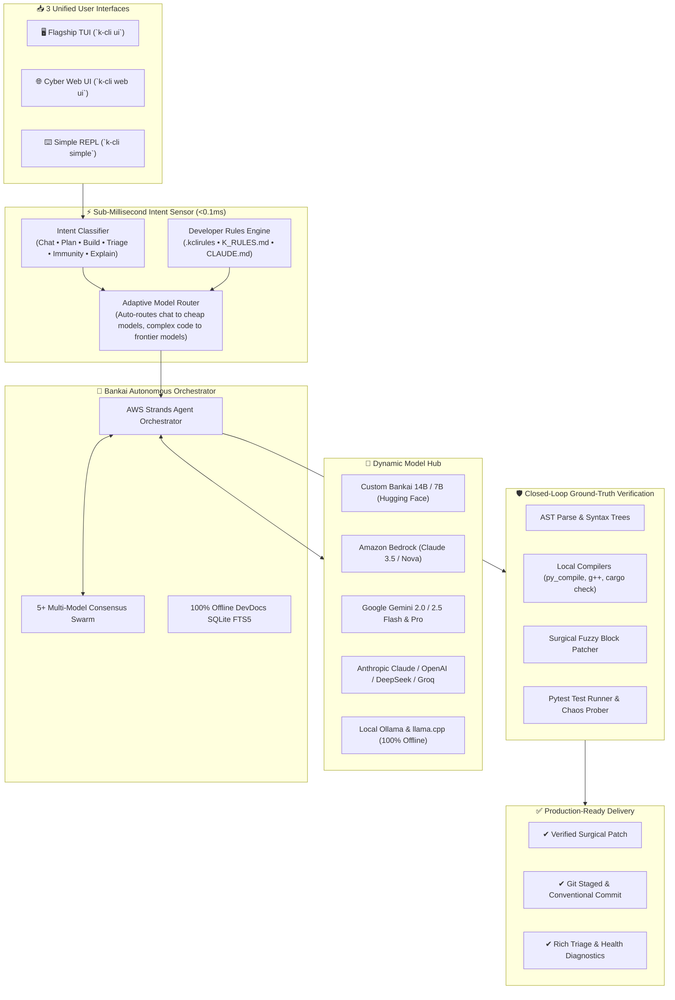

# ⚡ K-CLI for Devs: Autonomous Cyber Workstation & Self-Healing Agent
### Engineered by Krishiv Joshi ([@krishivjoshi](https://github.com/krishivjoshi219-collab)) | Built with AWS Strands Agents SDK

[](LICENSE)
[](https://python.org)
[](https://strandsagents.com)
[](https://huggingface.co/krishivjoshi/bankai-10b)
[](https://aws.amazon.com/bedrock/)

> **The next-generation autonomous developer workstation that unites 3 unified UI tiers, zero-latency intent sensing, compiler-grounded AST verification, custom Bankai frontier models, and multi-model consensus swarms into a single sovereign CLI.**

---

## 🌟 3 Unified UI Tiers — One Sovereign Engine

Whether you prefer a full-screen cyberpunk IDE, a browser dashboard, or a streamlined mouse-enabled text REPL, K-CLI provides the right interface for your workflow—all powered by the identical Project Bankai autonomous engine:

```
                      ┌────────────────────────────────────────────────────────┐
                      │             PROJECT BANKAI AUTONOMOUS ENGINE           │
                      │  • Sub-Millisecond Intent Sensor (<0.1ms)              │
                      │  • Adaptive Cost & Latency Model Router                │
                      │  • AST Ground-Truth Compiler Verification Loop         │
                      │  • Custom Developer Instructions (.kclirules)          │
                      │  • 100% Offline DevDocs SQLite FTS5 Search             │
                      └──────────────────────────┬─────────────────────────────┘
                                                 │
            ┌────────────────────────────────────┼──────────────────────────────────┐
            │                                    │                                  │
            ▼                                    ▼                                  ▼
   [ TIER 1: FLAGSHIP TUI ]            [ TIER 2: CYBER WEB UI ]           [ TIER 3: SIMPLE REPL ]
     `k-cli ui` / `k-cli tui`            `k-cli web ui` / `k-cli web`       `k-cli simple` / `k-cli chat`
 • 3-Pane Fullscreen Cyberstation    • Modern Glassmorphism Dashboard    • Instant Startup (<50ms)
 • Live RAM & Token Speedometers     • WebSocket Token Streaming (60fps) • Full Mouse Click & Scroll
 • Zero-Freeze Background Workers    • HUD Telemetry & Cost Gauges       • Persistent SQLite History
 • Unified Back Navigation (Esc/b)   • Custom Model Spotlights & Chips   • Interactive Slash Commands
```

### 1. 🖥️ Tier 1: Flagship Cyber Workstation TUI (`k-cli ui` / `k-cli tui`)
* **Full-Screen 3-Pane Textual Workstation**: Navigation radar, live execution stream with collapsible thinking drawers, and auxiliary AST inspector.
* **Zero-Freeze Anti-Hang Architecture**: All I/O, downloads, and LLM inference dispatch to background worker threads, keeping UI fluid at 60 FPS.
* **Standardized Back Navigation**: Every modal features prominent `[ ⮌ Back / Close (Esc) ]` buttons with instant `Esc` or `b` shortcuts.
* **1-Click Launcher Chips**: Immediate access to `/audit`, `/strands`, `/immune`, `/models`, `/codex`, `/keys`, and `/rules`.

### 2. 🌐 Tier 2: Cyber Station Modern Web Dashboard (`k-cli web ui` / `k-cli web`)
* **Cyberpunk Glassmorphism Frontend**: Dark obsidian glass panels with neon accents, HUD telemetry, and responsive layout.
* **Real-Time WebSocket Token Streaming**: Sub-50ms token latency with dynamic persona speedometers.
* **Custom Bankai Model Spotlights**: Dedicated cards for **Bankai-14B** and **Bankai-7B** fine-tuned frontier models.
* **1-Click Triage & Conflict Resolvers**: Browser-based incident auto-healer and 3-way AST merge viewer.

### 3. ⌨️ Tier 3: Streamlined Interactive Terminal REPL (`k-cli simple` / `k-cli chat`)
* **Lightweight & High-Performance**: Boots in `<50ms` with zero terminal overhead.
* **Full Mouse & Arrow Navigation**: Native click support, scrollback buffers, and multiline editing.
* **Interactive Slash Commands**: Autocomplete for `/help`, `/plan`, `/audit`, `/strands`, `/immune`, `/models`, `/keys`, `/rules`, `/clear`, `/exit`.

---

## ⚡ Adaptive Intent Sensor & Smart Model Router

K-CLI features a **sub-millisecond (<0.1ms) heuristic intent sensor** that dynamically adapts execution strategies and routes queries to the optimal online model:

| Sensed Intent | Detected Pattern | Execution Strategy | `AUTO` Model Routing Path |
| :--- | :--- | :--- | :--- |
| **`CHAT`** | Greetings, simple Q&A, chit-chat | Direct fast stream (<200ms) | **Fast & Cheap**: Gemini 2.0 Flash / Claude Haiku / GPT-4o-mini / Groq / Local SLM |
| **`PLAN`** | Architecture, design, milestones | Structured Milestone Blueprint | **Frontier Reasoning**: Claude 3.5 Sonnet / Gemini 2.5 Pro / GPT-4o / DeepSeek Reasoner |
| **`BUILD`** | Functions, endpoints, refactors | Closed-loop AST verification | **Coding Specialist**: Bankai-14B / Bankai-7B / Claude 3.5 Sonnet / DeepSeek Coder |
| **`TRIAGE`** | Stack traces, crashes, test failures | Strands Agent surgical auto-heal | **Incident Healer**: Premier diagnostic model with AST localizer |
| **`IMMUNITY`** | Chaos edge-cases, brittle patterns | Adversarial pytest synthesis | **Defensive Auditor**: Chaos inoculation engine |
| **`EXPLAIN`** | Walkthroughs, devdocs queries | SQLite FTS5 documentation search | **Offline Retrieval**: Instant cached signature lookup |

---

## 🤖 Custom Fine-Tuned Bankai Models (Hugging Face)

Fine-tuned specifically for compiler-grounded code generation, AST surgical healing, and multi-turn architectural reasoning by **Krishiv Joshi**:

* **⚡ Bankai-14B Frontier Model**: [`krishivjoshi/bankai-10b`](https://huggingface.co/krishivjoshi/bankai-10b) (Base: `Qwen/Qwen2.5-Coder-14B-Instruct`)
* **⚡ Bankai-7B High-Throughput Model**: [`krishivjoshi/bankai-7b`](https://huggingface.co/krishivjoshi/bankai-7b) (Base: `Qwen/Qwen2.5-Coder-7B-Instruct`)

```bash
# 1-Click download and stage Bankai models with SHA-256 verification
k-cli codex

# Or set as your default active model
k-cli models set-default krishivjoshi/bankai-10b
```

---

## 📋 Custom Developer Instructions (`.kclirules` / `K_RULES.md`)

Tailor K-CLI's autonomous behavior, coding standards, and architectural conventions for your project:

```bash
# Initialize a starter .kclirules template in your workspace
k-cli rules init

# Inspect active workspace and global instructions
k-cli rules get

# Set persistent global developer instructions
k-cli rules set "Always write modular async Python 3.12 code with strict Pydantic v2 schemas and pytest fixtures."
```

K-CLI automatically auto-discovers and respects:
* `.kclirules` • `K_RULES.md` • `.cursorrules` • `.kcli/rules.md` • `CLAUDE.md` • `AGENTS.md` • `~/.kcli/rules.md`

---

## 🏛️ System Architecture



---

## 🧠 Deep Backend Capabilities & Engineering Internals

Behind the responsive UI tiers, K-CLI is powered by a high-throughput, compiler-grounded deterministic engineering backend:

### 1. 🔍 AST Static Analysis & Semantic Scope Extractor
* **Language AST Engines**: Builds abstract syntax trees for Python (`ast.parse`), TypeScript/JavaScript, Rust, and C++.
* **Scope-Aware Context**: Localizes parent classes, functions, docstrings, and imports surrounding any targeted bug or conflict block to feed exact semantic context to models.

### 2. 🛡️ Closed-Loop Multi-Language Compiler & Sandbox Verifier
* **Hardened Compiler Guardrails**: Before any AI-generated patch is accepted, it passes real verification:
  * **Python**: `py_compile.compile()` + sandbox `pytest`
  * **C / C++**: `g++ -fsyntax-only -std=c++17`
  * **Rust**: `cargo check --message-format=json`
  * **Go**: `go build -o /dev/null`
  * **Node / TS**: `tsc --noEmit` / `node --check`
* **Zero Syntax Regressions**: If a generated patch fails compilation, the verifier captures stderr, feeds it to the debugger loop, and auto-retries up to 3 times.

### 3. ⚔️ 3-Way AST Semantic Conflict Studio
* **Diff3 / ZDiff3 Marker Parsing**: Robustly parses standard 2-way and complex 3-way conflict markers (`<<<<<<<`, `|||||||`, `=======`, `>>>>>>>`).
* **Semantic Synthesis**: Preserves upstream dependencies while retaining local feature logic, verifying the resolved file before auto-staging with `git add`.

### 4. 🛡️ Proactive Chaos Immunity & Edge-Case Prober
* **Brittle Pattern Detection**: Static visitor scans AST nodes for dangerous patterns:
  * `KeyError` hazards (unprotected dict key access `d[k]` vs `d.get(k)`)
  * `NoneType` attribute dereferences
  * Unbounded network/DB calls missing `timeout=`
  * Bare `except:` clauses swallowing system interrupts
* **Adversarial Test Synthesis**: Generates parameterized pytest test suites in `tests/chaos/` to prove immunity against malformed JSON, empty inputs, and null values.

### 5. 📚 100% Offline SQLite FTS5 DevDocs Engine
* **Instant Full-Text Search**: Embedded SQLite with BM25 ranking and FTS5 tokenizers over offline API reference documentation (FastAPI, Pytest, Boto3, Docker, Asyncio, Git).
* **Sub-Millisecond Retrieval (<1ms)**: Returns function signatures, parameter types, and docstrings without internet access or external vector DB dependencies.

### 6. ⚡ AWS Strands Agents SDK & Amazon Bedrock AgentCore
* **Deterministic `@tool` Registry**: Exposes 7 core engineering tools (`triage_and_heal_incident`, `verify_code_file`, `apply_surgical_patch`, `resolve_git_merge_conflict`, `inspect_repo_structure`, `search_offline_docs`, `generate_chaos_immunity_patch`).
* **Bedrock AgentCore CloudFormation**: Automated OpenAPI 3.0 Action Group generation and CloudFormation SAM deployment bundles via `k-cli bedrock export`.
* **Autonomous Background Healer Daemon**: `k-cli daemon` runs silently in the background, monitoring broken builds and auto-healing code, surfacing only when human approval is required.

---

## 📦 Installation & Setup

### 1. Clone & Install
```bash
git clone https://github.com/krishivjoshi219-collab/K-Cli-for-Devs.git
cd K-Cli-for-Devs
pip install -e .
```

### 2. Configure API Keys (Universal 1-Step Setup)
Paste any key into the interactive vault or set environment variables:
```bash
# Launch interactive Credential Vault
k-cli codex

# Or export environment variables directly
export GEMINI_API_KEY="your-gemini-api-key"
export ANTHROPIC_API_KEY="your-anthropic-api-key"
export OPENAI_API_KEY="your-openai-api-key"
export GROQ_API_KEY="your-groq-api-key"
export DEEPSEEK_API_KEY="your-deepseek-api-key"
export GITHUB_TOKEN="your-github-token"
```

---

## 💻 Quick Reference & Commands

```bash
# Launch Interfaces
k-cli ui                 # Launch Tier 1: Full-Screen Cyberstation TUI
k-cli web ui             # Launch Tier 2: Cyber Station Web Dashboard
k-cli simple ui          # Launch Tier 3: Streamlined Terminal REPL
k-cli demo-ui            # Pure Zero-AI Demo Mode (no keys required)

# Model Management
k-cli models list        # List verified online models
k-cli models set-default claude-3-5-sonnet  # Pin default model
k-cli models set-default auto               # Enable Adaptive Intent routing

# Autonomous Workflows & Background Self-Healing
k-cli strands "Fix authentication token expiry in auth_service.py"
k-cli auto-heal crash_report.log
k-cli daemon             # Autonomous background healing daemon (runs quietly, surfaces only on decisions)
k-cli bedrock export     # Export Amazon Bedrock AgentCore OpenAPI Action Groups & SAM bundle
k-cli bedrock deploy     # Deploy directly to Amazon Bedrock AgentCore
k-cli immune src/engine.py
k-cli conflict src/router.py
k-cli devdocs search "FastAPI Depends OAuth2"
```

---

## 🧪 Comprehensive Test Suite

Validate all 60+ unit, integration, and chaos test suites:
```bash
pytest tests/ -v
```

---

## 📄 License & Author

* **Author**: **Krishiv Joshi** ([@krishivjoshi](https://github.com/krishivjoshi219-collab))
* **License**: Open source under the [MIT License](LICENSE).
