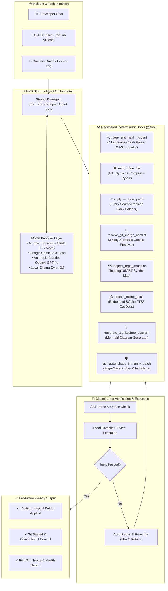

# ⚡ K-CLI for Devs: Autonomous Self-Healing DevOps Agent
### Built for the AWS *Agents for Humans* Hackathon — Professional Agents Track

[](LICENSE)
[](https://python.org)
[](https://strandsagents.com)
[](https://aws.amazon.com/bedrock/)

> **An autonomous, self-healing developer and SRE agent built with the AWS Strands Agents SDK. It ingests runtime crashes, broken CI/CD pipelines, and merge conflicts, diagnoses root causes with AST precision, and executes verified surgical fixes end-to-end.**

---

## 🎯 The Pitch (Agents for Humans Hackathon)

### 1. The Problem We're Solving
Modern software engineering teams waste countless hours triaging obscure CI/CD failures, parsing multi-language crash logs, and manually fixing merge conflicts. Traditional AI assistants only "chat" about bugs or generate unverified code snippets that hallucinate imports and introduce new regressions.

### 2. Who It's For
* **Software Engineers & SREs**: Who want instant, automated root-cause diagnosis and verified fixes for build failures.
* **DevOps Teams**: Automating CI/CD incident healing for GitHub Actions, Docker containers, and test suites.
* **Open Source Maintainers**: Resolving complex 3-way Git merge conflicts and regressions autonomously.

### 3. Why It Matters
**K-CLI for Devs does real work end-to-end, not just conversational advice.** 
Powered by the **AWS Strands Agents SDK**, it autonomously connects model reasoning (via Amazon Bedrock, Claude, Gemini, or local models) to heavy-duty deterministic engines. It enforces a strict **closed-loop ground-truth verification rule**: code is never committed until local compilers and test suites prove it works.

---

## 🏛️ System Architecture



---

## 🚀 Key Features

### 1. Multi-Language Crash & Traceback Parser
Parses and localizes stack traces across **7 distinct environments**:
* **Python**: Standard tracebacks & pytest assertion failures.
* **Node.js / TypeScript**: V8 stack traces and unhandled promises.
* **Rust**: Panics and backtraces.
* **Go**: Goroutine runtime panics.
* **C++**: ASAN/UBSAN memory error reports and core dump signals.
* **Docker**: OOMKilled (Exit Code 137) and container startup panics.
* **GitHub Actions CI**: `##[error]` log annotations and failing pipeline steps.

### 2. Closed-Loop Ground-Truth Verification (`verifier.py`)
Code generated or patched by the agent is strictly validated before final acceptance:
* **Python**: Static `ast.parse()` check + isolated `py_compile` and `pytest`.
* **Bash**: Subprocess `bash -n` syntax linting.
* **C++ / Rust / Go**: Isolated compiler syntax validation (`g++ -fsyntax-only`, `cargo check`).

### 3. Surgical Search/Replace Patching (`patcher.py`)
Applies line-accurate `<<<<<<< SEARCH / ======= / >>>>>>> REPLACE` modifications without rewriting entire files, eliminating hallucinated deletions and reducing latency.

### 4. 3-Way Git Conflict Resolver (`conflict_resolver.py`)
Parses Git conflict markers (`<<<<<<<`, `=======`, `>>>>>>>`), evaluates `BASE`, `OURS`, and `THEIRS` in AST context, and generates syntactically valid resolutions.

### 5. Autonomous Chaos Immunity & Edge-Case Self-Healing (`chaos_immunity.py`)
Proactively probes brittle AST patterns (KeyError, None dereference, socket/HTTP timeout hangs, ReDoS), synthesizes adversarial pytest suites in `tests/chaos/`, and applies verified defensive inoculation patches with zero regressions.

### 6. Pluggable Cloud & Local Models
Configured to run natively with:
* **Amazon Bedrock** (Anthropic Claude 3.5 Sonnet / Amazon Nova Pro)
* **Google Gemini** (Gemini 2.5 Flash / Pro)
* **Anthropic / OpenAI APIs**
* **Local Ollama** (100% offline air-gapped mode with embedded FTS5 DevDocs)

---

## 📦 Installation & Setup

### 1. Clone the Repository
```bash
git clone https://github.com/krishivjoshi219-collab/K-Cli-for-Devs.git
cd K-Cli-for-Devs
```

### 2. Install Dependencies
```bash
pip install -e .
```

### 3. Configure Environment Variables
Copy `.env.example` to `.env` and set your preferred provider credentials:

```bash
# Option A: Amazon Bedrock (Recommended for Hackathon)
export AWS_ACCESS_KEY_ID="your-access-key"
export AWS_SECRET_ACCESS_KEY="your-secret-key"
export AWS_DEFAULT_REGION="us-east-1"
export BEDROCK_MODEL_ID="anthropic.claude-3-5-sonnet-20241022-v2:0"

# Option B: Google Gemini
export GEMINI_API_KEY="your-gemini-api-key"

# Option C: OpenAI / Anthropic
export OPENAI_API_KEY="your-openai-api-key"
export ANTHROPIC_API_KEY="your-anthropic-api-key"
```

---

## 💻 Usage & CLI Reference

### 1. Autonomous Strands Agent Goal
Let the Strands Agent inspect your codebase, plan, and solve a task autonomously:
```bash
k-cli strands "Diagnose and fix the test failure in auth_service.py"
```

### 2. Deep Crash Triage & Closed-Loop Auto-Heal
Feed a raw stacktrace or CI/CD log file directly to the agent:
```bash
# From a log file
k-cli auto-heal crash_report.log

# Or pipe live output from a broken build
pytest | k-cli auto-heal
```

### 3. Autonomous Chaos Immunity & Zero-Day Inoculation
Probe edge cases, synthesize adversarial tests, and inoculate your code with defensive guards:
```bash
# Inoculate a specific module
k-cli immune src/handler.py

# Or sweep and inoculate the entire repository
k-cli immune
```

### 4. Standalone Ground-Truth Code Verification
Verify any source file against local compilers and AST checks:
```bash
k-cli verify src/handler.py
```

### 5. Interactive Full-Screen Terminal Workstation (TUI)
Launch the full Textual dashboard with real-time token speedometers and RAM monitors:
```bash
k-cli ui
```

---

## 🧪 Running the Test Suite

Execute the full suite of unit and integration tests:

```bash
pytest tests/ -v
```

All 13 Strands Agent and tool verification tests run in isolated sandboxes and validate end-to-end functionality.

---

## 📄 License & Open Source Compliance

This project is licensed under the **MIT License** — see the [LICENSE](LICENSE) file for details. Open source, transparent, and ready for community extension.
