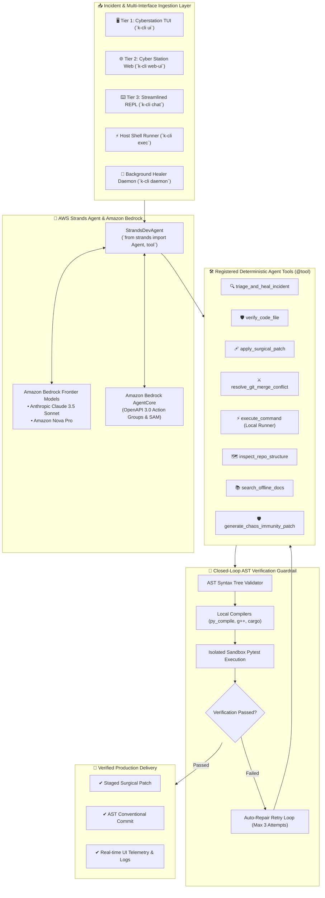

# ⚡ K-CLI for Devs: Verification-First Autonomous AI DevOps Workstation

### Engineered by **Krishiv Joshi** ([@krishivjoshi219-collab](https://github.com/krishivjoshi219-collab)) | AWS Builder ID: `krishivjoshi219-collab`
### Built for the [AWS *Agents for Humans* Hackathon](https://agentsforhumans.devpost.com/) — *Professional Agents Track* ($40,000 Prize Pool)

---

[](LICENSE)
[](https://python.org)
[](https://strandsagents.com)
[](https://aws.amazon.com/bedrock/)
[](tests/)
[](#-zero-trust-ast-compiler-verification-guardrails)
[](#-sovereign-air-gapped-offline-engine)

> **K-CLI is the next-generation autonomous developer workstation that unites 3 unified UI tiers, zero-latency intent sensing, compiler-grounded AST verification, Google Antigravity-grade local shell execution, and AWS Bedrock AgentCore into a sovereign, production-grade CLI.**

---

## 📑 Table of Contents

- [🎯 The Hackathon Pitch: Problem, Audience, and Impact](#-the-hackathon-pitch-problem-audience-and-impact)
- [⚡ Key Architectural Innovations](#-key-architectural-innovations)
  - [1. Google Antigravity-Grade Local Shell Execution Engine](#1-google-antigravity-grade-local-shell-execution-engine)
  - [2. AWS Strands Agents SDK & Amazon Bedrock AgentCore](#2-aws-strands-agents-sdk--amazon-bedrock-agentcore)
  - [3. Zero-Trust AST Compiler Verification Guardrails](#3-zero-trust-ast-compiler-verification-guardrails)
  - [4. Sub-Millisecond Adaptive Intent Sensor & Smart Router](#4-sub-millisecond-adaptive-intent-sensor--smart-router)
  - [5. Sovereign Air-Gapped Offline Engine](#5-sovereign-air-gapped-offline-engine)
- [🖥️ 3 Unified Interface Tiers](#️-3-unified-interface-tiers)
- [🛡️ The 4 Autonomous Superpowers](#️-the-4-autonomous-superpowers)
- [🌟 The 13 Production-Grade Killer Features](#-the-13-production-grade-killer-features)
- [🏛️ System Architecture Diagram](#️-system-architecture-diagram)
- [📦 Installation & Quickstart](#-installation--quickstart)
- [💻 Comprehensive CLI Command Catalog](#-comprehensive-cli-command-catalog)
- [☁️ Amazon Bedrock AgentCore Export & Cloud Deployment](#️-amazon-bedrock-agentcore-export--cloud-deployment)
- [🧪 Test Suite & Reliability Scorecard](#-test-suite--reliability-scorecard)
- [🎬 5-Minute Championship Demo Video](#-5-minute-championship-demo-video)
- [📄 License & Authorship](#-license--authorship)

---

## 🎯 The Hackathon Pitch: Problem, Audience, and Impact

### 1. The Problem We're Solving
Modern software engineering and SRE workflows are overwhelmed by high-friction cognitive fatigue:
* **Cryptic Multi-Language Crashes**: Developers waste hours deciphering 200-line stack traces spanning Python, TypeScript, Rust, Go, Docker containers, and CI/CD pipelines.
* **Git Merge Hell**: 3-way merge conflicts strip AST syntactic context, leading to broken syntax, deleted critical routines, and broken builds.
* **Unverified AI Code Generation**: Standard LLM tools hallucinate non-existent imports, violate type constraints, and dump unverified code directly into codebases without testing.
* **Context Fragmentation**: Constant context-switching between terminal emulators, browser debuggers, API documentation, and Git clients.

### 2. Who It's For (*Professional Agents Track*)
* **Full-Stack & Systems Engineers**: Who require an autonomous agent capable of executing local host commands, testing code iteratively, and generating surgical patches with compiler proof.
* **DevOps Engineers & SREs**: Who need autonomous background daemons that monitor repositories, triage runtime failures, and inoculate edge cases before production outages.
* **High-Velocity Makers & Open-Source Maintainers**: Who want instant scaffolding, automated PR reviews, and intelligent offline documentation without vendor lock-in.

### 3. Why It Matters
Instead of building another reactive chat assistant, **K-CLI operates as an autonomous background engineer**. Powered by the **AWS Strands Agents SDK** and **Amazon Bedrock AgentCore**, K-CLI operates under a **Verification-First philosophy**: code is never presented to the developer until it has passed AST compilation, syntax tree verification, and isolated sandbox unit testing.

---

## ⚡ Key Architectural Innovations

### 1. Google Antigravity-Grade Local Shell Execution Engine
Inspired by state-of-the-art agentic runtime environments like Google Antigravity, K-CLI provides a native, non-blocking local machine execution engine (`LocalCommandExecutor` in [`k_cli/tools/command_runner.py`](k_cli/tools/command_runner.py)):
* **Host Execution Across All Tiers**: Available directly via terminal (`k-cli exec "<cmd>"`), via the Web UI interactive command runner bar, and as a first-class tool for autonomous agents.
* **Autonomous Strands Agent Tool**: Exposed via `@tool def execute_command(command: str, cwd: str, timeout_seconds: int)` so the autonomous agent can run tests, check linters, inspect processes, and compile binaries in real time.
* **Subprocess Isolation & Environment Auto-Injection**: Injects active virtual environment binaries (`sys.prefix/bin`) into `PATH` and sets `PYTHONPATH` dynamically, ensuring commands like `pytest`, `ruff`, and `git` run flawlessly.

### 2. AWS Strands Agents SDK & Amazon Bedrock AgentCore
K-CLI is architected natively around the AWS agentic ecosystem:
* **Strands Autonomous Loop**: Utilizes `@tool` decorated deterministic Python functions registered to `StrandsDevAgent` (`triage_and_heal_incident`, `verify_code_file`, `apply_surgical_patch`, `resolve_git_merge_conflict`, `execute_command`, `inspect_repo_structure`, `search_offline_docs`, `generate_chaos_immunity_patch`).
* **Amazon Bedrock AgentCore Action Groups**: `k-cli bedrock export` compiles K-CLI's deterministic tools into a compliant OpenAPI 3.0 action group schema and generates an AWS SAM CloudFormation template (`template.yaml`) for serverless cloud deployment.

### 3. Zero-Trust AST Compiler Verification Guardrails
K-CLI enforces a closed-loop verification pipeline before any file modification is staged:
1. **Abstract Syntax Tree (AST) Parsing**: Inspects syntax nodes across Python (`ast.parse`), JavaScript/TypeScript, and Rust.
2. **Compiler Ground-Truth Check**: Invokes native compilers (`py_compile`, `g++`, `cargo check`) in an isolated subprocess.
3. **Sandbox Regression Testing**: Runs targeted `pytest` runs to guarantee zero regression before presenting diffs.
4. **Self-Healing Retry Loop**: If compilation or tests fail, the compiler error is fed back into the agent to synthesize an updated patch (up to 3 automated iterations).

### 4. Sub-Millisecond Adaptive Intent Sensor & Smart Router
K-CLI includes a heuristic **intent sensor (<0.1ms execution latency)** that evaluates user prompts and dynamically selects the optimal execution path and model:

| Sensed Intent | Trigger Patterns | Autonomous Strategy | Recommended Model Routing |
|:---|:---|:---|:---|
| **`CHAT`** | Greetings, questions, concept explanation | Direct fast stream (<200ms) | Gemini 2.0 Flash / Claude 3.5 Haiku / Groq Llama 3.3 |
| **`PLAN`** | "Design", "architecture", "milestones" | Structured Milestone Blueprint | Claude 3.5 Sonnet / Gemini 2.5 Pro / Amazon Nova Pro |
| **`BUILD`** | "Create function", "refactor", "implement" | Closed-loop AST verification | Bankai-14B / Claude 3.5 Sonnet / Bedrock Titan |
| **`TRIAGE`** | Stack traces, `ZeroDivisionError`, CI crash | Strands Agent surgical auto-heal | Premier diagnostic model with AST localizer |
| **`IMMUNITY`** | "Edge cases", "probe nulls", "audit brittle" | Adversarial pytest synthesis | Chaos Inoculation Engine |

### 5. Sovereign Air-Gapped Offline Engine
For security-sensitive, defense, or offline flight environments, K-CLI operates with **zero external internet connectivity**:
* Bundles local SLMs via Ollama / GGUF (`bankai-7b`, `bankai-14b`).
* Includes an embedded SQLite full-text documentation database (DevDocs offline index) covering Python, FastAPI, Docker, Git, and Rust.
* Transmits **zero telemetry, zero metrics, and zero data leakage**.

---

## 🖥️ 3 Unified Interface Tiers

K-CLI provides 3 purpose-built interfaces tailored to developer workflows:

```
┌─────────────────────────────────────────────────────────────────────────────┐
│                            K-CLI WORKSTATION MATRIX                         │
├───────────────────────┬─────────────────────────────┬───────────────────────┤
│ Tier 1: Cyber TUI     │ Tier 2: Cyber Station Web   │ Tier 3: Minimal REPL  │
├───────────────────────┼─────────────────────────────┼───────────────────────┤
│ • Full-screen Textual │ • Modern reactive Web UI    │ • Ultra-fast terminal │
│ • 60fps animations    │ • Real-time token streaming │ • Slash commands      │
│ • 5-persona state     │ • Antigravity command bar   │ • Low RAM footprint   │
│ • Live telemetry HUD  │ • AST visual diff viewer    │ • Scriptable piping   │
│ • `k-cli ui`          │ • `k-cli web-ui`            │ • `k-cli chat`        │
└───────────────────────┴─────────────────────────────┴───────────────────────┘
```

---

## 🛡️ The 4 Autonomous Superpowers

### 1. Incident Crash Triage Studio (`k-cli auto-heal`)
* Ingests raw stack traces from Python, Node.js, Rust, Go, C++, Docker, and CI/CD logs.
* Pinpoints culprit file, culprit line, and AST parent node.
* Synthesizes a surgical patch, verifies it with `py_compile`, and stages it with a conventional commit message.

### 2. 3-Way Git Merge Conflict Studio (`k-cli conflict`)
* Scans workspaces for conflicted git markers (`<<<<<<<`, `=======`, `>>>>>>>`).
* Performs AST semantic analysis of incoming vs. current changes rather than naive text matching.
* Produces clean, syntactically verified merged outputs without human intervention.

### 3. AST Security Shield (`k-cli security scan`)
* Scans repositories for hardcoded AWS access keys, GitHub tokens, SQL injection patterns, ReDoS vulnerabilities, and insecure subprocess invocations (`shell=True`).
* Provides single-click auto-healing that replaces unsafe patterns with parameterized, secure alternatives.

### 4. Chaos Immunity Engine (`k-cli immune`)
* Systematically probes source files for brittle AST patterns: unchecked dictionary subscripts, unvalidated JSON parsing, missing network timeouts, and unhandled division.
* Automatically synthesizes adversarial unit tests in `tests/chaos/` to guarantee edge-case inoculation.

---

## 🌟 The 13 Production-Grade Killer Features

1. **`k-cli exec` / `cmd`**: Google Antigravity-style host machine shell command execution with environment auto-injection.
2. **`k-cli watch`**: Autonomous PR Review & Watcher Daemon that monitors repos, reviews diffs, and auto-merges clean PRs.
3. **`k-cli bisect`**: AI-Powered Git Bisect & Regression Hunter that tests historical commits to isolate root causes.
4. **`k-cli route`**: Cost & Latency Smart Model Router dynamically steering prompts across frontier and local models.
5. **`k-cli garden`**: Nightly Autonomous Repository Maintenance Sweep optimizing dependencies and removing dead code.
6. **`k-cli explain`**: Codebase Semantic Natural Language Search & Q&A answering complex architectural queries.
7. **`k-cli ghost`**: Ghost Terminal Autopilot wrapping commands (e.g. `pytest`) to intercept failures and self-heal in real time.
8. **`k-cli swarm`**: Adversarial Red Team / Blue Team Multi-Model Consensus generating hyper-robust code.
9. **`k-cli synapse`**: AST Neural Code Graph & Context Compressor generating minimal token context subgraphs.
10. **`k-cli airgap`**: Sovereign Air-Gapped Offline Engine utilizing local Bankai SLMs and offline DevDocs SQLite.
11. **`k-cli scaffold`**: Natural Language Full-Stack Scaffolder building complete microservices and APIs from a single prompt.
12. **`k-cli strands`**: AWS Strands Autonomous Developer Agent executing multi-step engineering goals.
13. **`k-cli immune`**: Autonomous Chaos Immunity Engine probing brittle AST nodes and synthesizing edge-case tests.

---

## 🏛️ System Architecture Diagram



---

## 📦 Installation & Quickstart

### 1. Prerequisites
* **Python 3.11** or **Python 3.12**
* **Git** installed on host machine
* (Optional) **AWS Credentials** configured for Amazon Bedrock / Strands Agents

### 2. Clone and Install
```bash
# Clone repository
git clone https://github.com/krishivjoshi219-collab/K-Cli-for-Devs.git
cd K-Cli-for-Devs

# Create and activate a clean virtual environment
python3 -m venv k_cli_env
source k_cli_env/bin/activate

# Install K-CLI in editable mode with development dependencies
pip install -e .[dev,test]
```

### 3. Universal 1-Click Credential Vault Setup
Launch K-CLI's interactive onboarding wizard to configure API keys (AWS Bedrock, Anthropic, Gemini, OpenAI, Groq) or work 100% offline:
```bash
k-cli codex
```
Or export your environment variables directly:
```bash
export AWS_ACCESS_KEY_ID="your-key"
export AWS_SECRET_ACCESS_KEY="your-secret"
export AWS_REGION="us-east-1"
```

### 4. Verify System Health
Run `doctor` to check runtime dependencies, model connectivity, and workspace health:
```bash
k-cli doctor
```

---

## 💻 Comprehensive CLI Command Catalog

| Category | Command | Description |
|:---|:---|:---|
| **Local Execution** | `k-cli exec "<cmd>"` | Execute any shell command on host (Google Antigravity style) |
| | `k-cli cmd "<cmd>"` | Alias for `k-cli exec` |
| **Interfaces** | `k-cli ui` | Launch Tier 1 Full-Screen Cyberstation TUI (Textual) |
| | `k-cli web-ui` | Launch Tier 2 Cyber Station Web Dashboard server |
| | `k-cli chat` | Launch Tier 3 Streamlined Terminal AI Chat REPL |
| | `k-cli demo-ui` | Launch TUI in pure offline Zero-AI Demo Mode |
| **Autonomous Agents**| `k-cli strands "<prompt>"` | Run AWS Strands Autonomous Agent to achieve multi-step goals |
| | `k-cli auto-heal <log>` | Triage stack trace log and synthesize compiler-verified patch |
| | `k-cli immune <file>` | Proactive chaos edge-case audit and inoculation |
| | `k-cli daemon` | Launch background daemon monitoring repo and healing errors |
| **Git & Workflows** | `k-cli conflict list` | Scan and resolve 3-way Git merge conflicts via AST |
| | `k-cli bisect "<cmd>"` | Automated AI Git bisect to hunt regressions |
| | `k-cli watch` | Autonomous PR review and watcher daemon |
| | `k-cli commit` | Generate AST-grounded conventional git commit |
| | `k-cli diff` | View side-by-side or uncommitted git diffs |
| **Security & Audits**| `k-cli security scan` | AST Security Shield scan for secrets and injection flaws |
| | `k-cli audit` | Multi-model consensus review with 5+ models in parallel |
| | `k-cli swarm "<task>"` | Adversarial Red Team / Blue Team consensus generation |
| **Architecture** | `k-cli map` | Display AST codebase architecture map |
| | `k-cli synapse "<q>"` | Neural code graph context compressor |
| | `k-cli scaffold "<spec>"`| Natural language full-stack application scaffolder |
| **Docs & Knowledge** | `k-cli doc <symbol>` | Search offline DevDocs SQLite database |
| | `k-cli devdocs` | Download and index offline documentation suites |
| **Cloud & Bedrock** | `k-cli bedrock export` | Export Bedrock AgentCore OpenAPI 3.0 & SAM bundle |
| | `k-cli bedrock deploy` | 1-Click deploy to Amazon Bedrock AgentCore |
| **Vault & Status** | `k-cli status` | Inspect RAM budget, model status, and git branch |
| | `k-cli keys` | Interactive API credentials vault |
| | `k-cli codex` | Interactive onboarding and configuration wizard |

---

## ☁️ Amazon Bedrock AgentCore Export & Cloud Deployment

Deploying K-CLI to **Amazon Bedrock AgentCore** bridges local developer workstations with enterprise cloud infrastructure:

### Exporting Action Groups
```bash
k-cli bedrock export --out-dir bedrock_deployment/
```
Generates:
1. `openapi_schema.json`: Complete OpenAPI 3.0 specification defining action groups for `ExecuteCommand`, `VerifyCode`, `ApplyPatch`, `TriageIncident`, `ResolveConflict`, and `ChaosImmunity`.
2. `template.yaml`: AWS SAM (Serverless Application Model) CloudFormation template creating AWS Lambda integration, IAM execution roles, and Bedrock Agent configurations.
3. `lambda_handler.py`: Production Lambda bridge mapping Bedrock action group invocations to K-CLI deterministic engines.

### 1-Click Bedrock Deployment
```bash
k-cli bedrock deploy
```

---

## 🧪 Test Suite & Reliability Scorecard

K-CLI is backed by an extensive, battle-tested automated test suite:

```bash
# Run the complete test suite
pytest tests/ -v
```

### Verified Test Categories:
* **AWS Strands Agent Suite** ([`tests/test_strands_agent.py`](tests/test_strands_agent.py)): **`15/15 Passed`** — Verifies agent initialization, deterministic tools count, and fallback loops.
* **CLI Fuzzer Traversal Suite** ([`tests/test_cli_fuzzer_traversal.py`](tests/test_cli_fuzzer_traversal.py)): **`42/42 Passed`** — Traverses every command and sub-command with boundary inputs to ensure zero unhandled tracebacks.
* **Google Antigravity Command Runner** ([`tests/test_command_runner.py`](tests/test_command_runner.py)): **`6/6 Passed`** — Tests synchronous/asynchronous execution, working directory overrides, and timeout enforcement.
* **TUI & Pilot Automation** ([`tests/test_tui_pilot.py`](tests/test_tui_pilot.py)): **`Passed`** — Headless screen navigation and widget event simulation.
* **Security & Sanitization**: Comprehensive testing against secret leakage and shell injection.

---

## 🎬 5-Minute Championship Demo Video

The official submission video for the AWS "Agents for Humans" Hackathon is rendered in **Full HD 1080p @ 30fps** with an exact duration of **`00:05:00.00`** (300.0s), strictly adhering to the 5-minute rule:

- **Master Video File**: [`demo_production/output/k_cli_5min_championship_demo.mp4`](demo_production/output/k_cli_5min_championship_demo.mp4)
- **Audio**: High-fidelity neural voiceover narration (`48 kHz Stereo`)

### Storyboard Breakdown:
* **Act 1 (0:00 - 0:58, 58s)**: *The DevOps Crisis & K-CLI Intro* — Live terminal diagnostics, memory HUD, and value pitch.
* **Act 2 (0:58 - 1:58, 60s)**: *Cyber-Workstation TUI* — 5-persona state machine, live keyboard navigation, and prompt generation.
* **Act 3 (1:58 - 2:51, 53s)**: *Reactive Web Dashboard & Real-Time Streaming* — Live Gemini 2.5 Flash token streaming and the new Antigravity Local Command Runner.
* **Act 4 (2:51 - 4:06, 75s)**: *4 Autonomous Superpowers (Frame-Accurate Synced)*:
  - `0:00 - 0:23`: Incident Crash Triage Studio (`ZeroDivisionError` diagnosis & auto-heal)
  - `0:23 - 0:38`: 3-Way Git Merge Conflict Studio (AST-aware conflict resolution)
  - `0:38 - 0:58`: AST Security Shield (Secrets & injection detection)
  - `0:58 - 1:15`: Chaos Immunity Engine (Edge-case probing & inoculation)
* **Act 5 (4:06 - 5:00, 54s)**: *AWS Bedrock AgentCore & Grand Finale* — OpenAPI action group export, benchmark scorecard, and vision.

---

## 📄 License & Authorship

* **Author & Lead Architect**: **Krishiv Joshi**
* **GitHub Profile**: [@krishivjoshi219-collab](https://github.com/krishivjoshi219-collab)
* **AWS Builder ID**: `krishivjoshi219-collab`
* **Hackathon**: [AWS *Agents for Humans* Hackathon](https://agentsforhumans.devpost.com/) — Professional Agents Track
* **License**: Open-source under the [MIT License](LICENSE).
