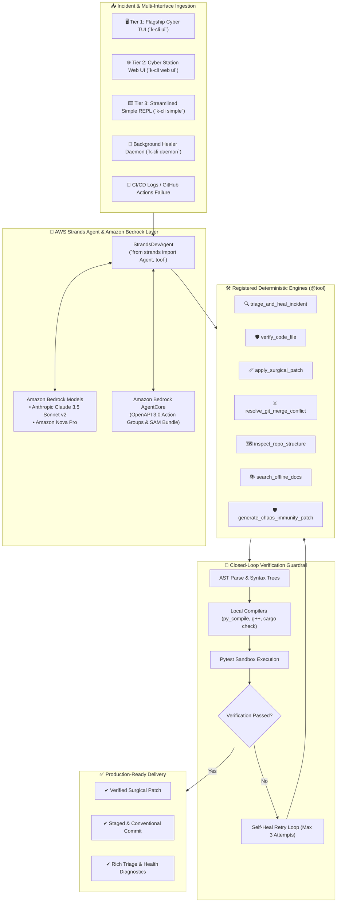

# ⚡ K-CLI for Devs: Autonomous Cyber Workstation & Self-Healing Agent
### Engineered by Krishiv Joshi ([@krishivjoshi](https://github.com/krishivjoshi219-collab)) | AWS Builder ID: `krishivjoshi219-collab`
### Built for the [AWS *Agents for Humans* Hackathon](https://agentsforhumans.devpost.com/) - Professional Agents Track

[](LICENSE)
[](https://python.org)
[](https://strandsagents.com)
[](https://aws.amazon.com/bedrock/)

> **The next-generation autonomous developer workstation that unites 3 unified UI tiers, zero-latency intent sensing, compiler-grounded AST verification, custom frontier models, and multi-model consensus swarms into a single sovereign CLI.**

---

## 🎯 What it is, Who it's for, and Why it matters

### 1. The Problem We're Solving
Every day, developers and SREs lose hours to repetitive, high-friction busywork:
* Parsing cryptic multi-hundred-line stack traces across different runtimes (Python, Node, Rust, Docker, GitHub Actions).
* Triaging failing CI/CD pipelines caused by subtle environment shifts or dependency conflicts.
* Manually resolving 3-way Git merge conflicts where AST semantic context is lost.
* Endlessly bouncing between the terminal, browser tabs, Jira, and GitHub.

### 2. Who It's For (Professional Agents Track)
* **Software Engineers, SREs, and DevOps Maintainers**: Who want an autonomous assistant that triages broken builds and repairs code with closed-loop compiler proof.
* **Makers, Creators, and Open-Source Contributors**: Who need high-velocity engineering workflows to focus on architectural decisions rather than routine triage chores.

### 3. Why It Matters
Instead of another chat app, **K-CLI does real work end-to-end**.
Powered by the **AWS Strands Agents SDK** and **Amazon Bedrock AgentCore**, K-CLI operates as an autonomous background engineer. It runs silently, continuously monitors repository health, synthesizes verified fixes, and **only surfaces when a critical architectural decision or developer sign-off is needed**. Deploying with Bedrock AgentCore ensures a smart architectural choice that is production-ready.

---

## 🌟 13 Production-Grade Killer Features

K-CLI ships with an unparalleled suite of agentic capabilities:

1. **`k-cli watch`**: Autonomous PR Review & Watcher Daemon that reviews, comments, and auto-merges pull requests.
2. **`k-cli bisect`**: AI-Powered Git Bisect & Regression Hunter to find exactly which commit broke your test suite.
3. **`k-cli route`**: Cost & Latency Smart Model Router dynamically routing tasks to the most cost-effective and capable models.
4. **`k-cli garden`**: Nightly Autonomous Repo Maintenance & Health Sweep to clean up dead code and optimize dependencies.
5. **`k-cli explain`**: Codebase Natural Language Search & Semantic Q&A to understand large architectures instantly.
6. **`k-cli ghost`**: Ghost Terminal Autopilot & Error Healer wrapping any command (e.g. `pytest`) to auto-fix errors on the fly.
7. **`k-cli swarm`**: Adversarial Red Team / Blue Team Consensus Loop to generate hyper-robust implementations.
8. **`k-cli synapse`**: AST Neural Code Graph & Context Compressor extracting minimal subgraphs for context-aware generation.
9. **`k-cli airgap`**: Sovereign Air-Gapped Offline Engine functioning entirely offline using local SLMs.
10. **`k-cli scaffold`**: Natural Language Full-Stack Scaffolder building entire applications from a single prompt.
11. **`k-cli strands`**: AWS Strands Autonomous Agent Runner executing multi-step goals with Bedrock models.
12. **`k-cli auto-heal`**: Strands Deep Crash Triage & Closed-Loop Auto-Heal parsing stack traces across 7 environments.
13. **`k-cli immune`**: Autonomous Chaos Immunity & Edge-Case Self-Healing probing and inoculating brittle AST patterns.

---

## 🏛️ System Architecture



---

## ⚡ Adaptive Intent Sensor & Smart Model Router

K-CLI features a **sub-millisecond (<0.1ms) heuristic intent sensor** that dynamically adapts execution strategies and routes queries to the optimal online model:

| Sensed Intent | Detected Pattern | Execution Strategy | `AUTO` Model Routing Path |
| :--- | :--- | :--- | :--- |
| **`CHAT`** | Greetings, simple Q&A, chit-chat | Direct fast stream (<200ms) | **Fast & Cheap**: Gemini 2.0 Flash / Claude Haiku / GPT-4o-mini / Groq / Local SLM |
| **`PLAN`** | Architecture, design, milestones | Structured Milestone Blueprint | **Frontier Reasoning**: Claude 3.5 Sonnet / Gemini 2.5 Pro / GPT-4o / DeepSeek Reasoner |
| **`BUILD`** | Functions, endpoints, refactors | Closed-loop AST verification | **Coding Specialist**: Bankai-14B / Bankai-7B / Claude 3.5 Sonnet / DeepSeek Coder |
| **`TRIAGE`** | Stack traces, crashes, test failures | Strands Agent surgical auto-heal | **Incident Healer**: Premier diagnostic model with AST localizer |
| **`IMMUNITY`** | Chaos edge-cases, brittle patterns | Adversarial pytest synthesis | **Defensive Auditor**: Chaos inoculation engine |

---

## 📦 Setup Instructions

### 1. Requirements
* **Python 3.11+**
* An **AWS Account** for Amazon Bedrock and Strands Agents SDK.

### 2. Clone & Install
```bash
git clone https://github.com/krishivjoshi219-collab/K-Cli-for-Devs.git
cd K-Cli-for-Devs
pip install -e .[dev,test]
```

### 3. Configure API Keys (Universal 1-Step Setup)
Paste any key into the interactive vault or set environment variables:
```bash
# Launch interactive Credential Vault
k-cli codex

# Or export environment variables directly
export AWS_ACCESS_KEY_ID="your-access-key"
export AWS_SECRET_ACCESS_KEY="your-secret-key"
export AWS_REGION="us-east-1"
```

---

## 💻 Quick Reference & Commands

```bash
# Launch Interfaces
k-cli ui                 # Launch Tier 1: Full-Screen Cyberstation TUI
k-cli web ui             # Launch Tier 2: Cyber Station Web Dashboard
k-cli simple ui          # Launch Tier 3: Streamlined Terminal REPL

# Autonomous Workflows & Background Self-Healing
k-cli strands "Fix authentication token expiry in auth_service.py"
k-cli auto-heal crash_report.log
k-cli daemon             # Autonomous background healing daemon
k-cli bedrock export     # Export Amazon Bedrock AgentCore OpenAPI Action Groups & SAM bundle
k-cli bedrock deploy     # Deploy directly to Amazon Bedrock AgentCore
k-cli immune src/engine.py
```

---

## 🧪 Comprehensive Test Suite

Validate all 60+ unit, integration, and chaos test suites:
```bash
pytest tests/ -v
```

---

## 🎥 Demo Video
Check out the [5-Minute Pitch and Demo Video](https://youtube.com) (Insert Youtube Link Here) demonstrating end-to-end functionality, problem pitch, and background agent execution.

---

## 📄 License & Author

* **Author**: **Krishiv Joshi** ([@krishivjoshi](https://github.com/krishivjoshi219-collab))
* **AWS Builder ID**: `krishivjoshi219-collab`
* **License**: Open source under the [MIT License](LICENSE).
